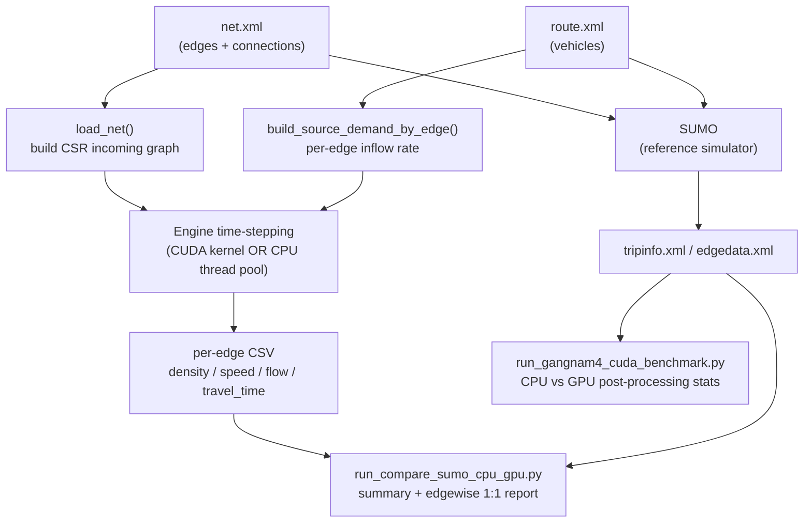

# Architecture — Gangnam-4 Edge-Parallel Traffic Simulator

## Overview

This project is a SUMO-independent traffic simulator for the Gangnam-4-district
road network, evolved through three engine families of increasing fidelity, all
validated against SUMO and all in `gangnam4_cuda/`:

1. **Edge macro** (gen-1) — one LWR density cell per road *edge*. CPU + GPU.
2. **Lane macro / CTM** (gen-2) — one cell per *lane*, Daganzo Cell-Transmission
   Model with sending/receiving flux, priority/yield merge, route-derived turn
   split, per-movement (HCM) capacity, and a global free-flow calibration
   (`--vmax-scale`). CPU + GPU. The GPU path is fully gather-based (no
   atomics), fused into ~9 kernels, and CUDA-Graph-captured → **0.09 s for a
   1-hour, 100k-vehicle sim on an RTX 3090** (~24,000× faster than SUMO).
3. **Mesoscopic** (gen-3) — individual *vehicles* routed edge-to-edge via a
   time-stepped spatial-queue model. Produces per-vehicle travel times (a
   validation axis the macro engines can't reach) and wins decisively on
   flow/speed/density correlation vs SUMO.

See **Engine families & validation** below for the accuracy/speed comparison.

## Components

| File | Role | Entrypoint |
| --- | --- | --- |
| `gangnam4_cuda/cuda_edge_simulator.py` | GPU engine. One CUDA thread per edge; CuPy `RawKernel` advances density/speed/flow. Writes per-edge CSV. | `python3 cuda_edge_simulator.py` |
| `gangnam4_cuda/cpu_edge_simulator_mt.py` | CPU twin of the GPU engine. Splits edges into chunks across a thread pool. Identical model, I/O, and CSV schema. | `python3 cpu_edge_simulator_mt.py` |
| `gangnam4_cuda/run_compare_sumo_cpu_gpu.py` | Orchestrator. Runs SUMO, CPU-MT, and GPU (in Docker) under identical net/route/duration; emits a summary report and an edge-wise 1:1 comparison CSV. | `python3 run_compare_sumo_cpu_gpu.py` |
| `gangnam4_cuda/run_gangnam4_cuda_benchmark.py` | Benchmarks CUDA vs CPU on **post-processing** of SUMO `tripinfo` XML (streaming parse + stats). Optionally runs SUMO first. GPU backend autodetect. | `python3 run_gangnam4_cuda_benchmark.py` |
| `gangnam4_cuda/Dockerfile` | `nvidia/cuda:12.3.2-devel-ubuntu22.04` + SUMO + numpy + cupy-cuda12x. Image used by the compare script. | `docker build -t gangnam4-cuda-sumo:latest .` |
| `gangnam4_cuda/lane_common.py` | **Lane-level** shared module: lane loader, lane→lane CSR graph, lateral-neighbor graph, turn-demand builder, edge aggregation. | imported |
| `gangnam4_cuda/lane_cpu_simulator_mt.py` | Lane-level CPU engine (thread pool over lanes; longitudinal + turn-demand lane-change). | `python3 lane_cpu_simulator_mt.py` |
| `gangnam4_cuda/lane_cuda_simulator.py` | Lane-level GPU engine (CuPy, one thread per lane; same two-phase model). | `python3 lane_cuda_simulator.py` |
| `gangnam4_cuda/run_engine.py` | **Dispatcher** — selects engine (`--engine edge\|lane`) × backend (`--backend cpu\|gpu`) and forwards remaining args to the chosen simulator. `--list` shows options, `--dry-run` prints the command. | `python3 run_engine.py --engine lane --backend cpu ...` |
| `gangnam4_cuda/run_compare_sumo.py` | **Engine-agnostic validation harness** — same data, swap engine via `--engine {edge,lane} --backend {cpu,gpu}`. Routes through the dispatcher, handles edge-vs-lane output schema differences, compares against SUMO edgedata (`--run-sumo`/`--sumo-edgedata`) or any edge-keyed CSV (`--ref-edge-csv`). Reports Pearson r / MAE / RMSE on speed·density·flow and worst-K congestion-hotspot Jaccard overlap. | `python3 run_compare_sumo.py --engine lane --run-sumo ...` |
| `gangnam4_cuda/cell_common.py`, `cell_cpu_simulator.py` | **Multi-cell CTM** — subdivides each lane into ~15 m cells. Experiment; no accuracy gain for time-averaged metrics (kept for time-resolved/packet follow-ups). | `python3 cell_cpu_simulator.py` |
| `gangnam4_cuda/meso_common.py`, `meso_sim.py` | **Mesoscopic engine** — vehicle loader + time-stepped spatial-queue simulator. Outputs per-vehicle travel times + edge density/speed/measured-throughput. | `python3 meso_sim.py --vmax-scale 0.5` |
| `gangnam4_cuda/compare_tripinfo.py` | Per-vehicle travel-time comparison: SUMO `tripinfo` vs meso trip CSV (matched by vehicle id; Pearson r / MAE / bias). | `python3 compare_tripinfo.py --sumo-tripinfo ... --meso-trips ...` |

## Data flow



## Core model (shared by both engines)

The simulation heart is identical in the CUDA kernel (`step_kernel` in
`cuda_edge_simulator.py`) and the CPU `step_chunk()` (`cpu_edge_simulator_mt.py`).

**Network as a CSR incoming-edge graph.** `load_net()` parses a SUMO `net.xml`,
keeping only real edges (drops `id` starting with `:` and
`internal`/`crossing`/`walkingarea` functions) that have at least one lane. From
each `<connection from=... to=...>` it builds a CSR structure of *incoming*
edges per edge:

- `in_ptr[i] .. in_ptr[i+1]` — slice into `in_edges`/`in_weights` for edge `i`.
- `in_edges[k]` — index of an upstream edge feeding edge `i`.
- `in_weights[k]` — split fraction `1 / outgoing_count(from)` (flow leaving an
  upstream edge is divided evenly among its outgoing connections).

**Per-edge demand.** `build_source_demand_by_edge()` streams the route file and
counts vehicles whose route *starts* on each edge, then divides by
`sim_duration` to get an inflow rate (veh/s). Edges with no upstream connection
use this source demand; all others derive inflow from upstream flow.

**Per-step update** (LWR / Greenshields-style), per edge `i`:

```
inflow  = source_demand[i]                       if edge has no upstream
        = Σ flow[in_edges[k]] · in_weights[k]     otherwise
v       = vmax[i] · (1 − rho[i] / rho_jam[i])     (clamped ≥ 0)
outflow = rho[i] · v
rho'    = rho[i] + dt · (inflow − outflow) / length[i]   (clamped to [0, rho_jam])
v'      = vmax[i] · (1 − rho' / rho_jam[i])       (clamped ≥ 0)
flow'   = rho' · v'
```

`rho_jam[i] = jam_density_per_lane · lanes[i]`. State (`rho`, `flow`) is held in
two buffers and **double-buffer swapped** each step. `speed` is written in place.

**Output CSV schema** (written by both engines):

```
edge_id, length_m, lanes, vmax_mps, density_veh_per_m,
speed_mps, flow_veh_per_s, speed_ratio, travel_time_s
```

where `speed_ratio = speed / vmax` and `travel_time_s = length / max(speed, 0.1)`.

## CUDA vs CPU engines

Both engines load the net, build demand, initialize `rho` from a seeded uniform
jitter around `init_density`, run one priming step to align `flow`/`speed`, then
loop `steps` times.

- **GPU** (`cuda_edge_simulator.py`): the model is a C `extern "C" __global__`
  kernel compiled via `cp.RawKernel`. Grid = `ceil(n / threads_per_block)`
  blocks; one thread per edge. State lives in device arrays; `deviceSynchronize`
  before reading results back. Requires `cupy`.
- **CPU** (`cpu_edge_simulator_mt.py`): edges are split into `num_workers`
  contiguous chunks; each step submits one task per chunk to a
  `ThreadPoolExecutor` and joins before swapping buffers. Uses `numpy` only.

What is **identical**: the update math, the CSR graph, demand construction, CLI
surface, log format, and CSV output — so their CSVs are directly comparable.

## Comparison & benchmark harnesses

**`run_compare_sumo_cpu_gpu.py`** — runs all three engines under the *same*
net/route/duration:

1. Generates a `.sumocfg` (with summary/tripinfo/statistic/edgedata outputs) and
   runs SUMO.
2. Runs the CPU-MT engine.
3. Runs the GPU engine (by default inside Docker with `--gpus all`, mounting the
   workspace; `--no-gpu-in-docker` runs it directly).
4. Writes a summary report (`*_report.csv`) with per-engine runtime and mean
   speed/time, plus an **edge-wise 1:1** report (`*_report_edgewise.csv`)
   joining SUMO's last-interval edgedata against CPU and GPU per-edge metrics
   with absolute speed/travel-time errors.

**`run_gangnam4_cuda_benchmark.py`** — note this script does **not** run the
edge-parallel model on GPU. SUMO is the simulator; CUDA is used only to
**post-process** SUMO `tripinfo` output. It optionally runs SUMO (isolating
outputs per run-id, waiting for the tripinfo closing tag to avoid a race),
streams the `tripinfo` XML, then computes summary stats (`duration_mean`,
`duration_p95`, `waiting_mean`, `speed_mean`) on both CPU (numpy) and GPU, and
reports the CPU/GPU speedup.

## Lane-level engine (차선별)

The lane-level engine is the project's second-generation model: it simulates each
**lane** as its own unit instead of aggregating an edge's lanes. It reuses the
edge engine's structure (CLI, logging, double-buffer loop, CPU/GPU parity, CSV)
but adds a lateral (lane-change) dimension. The edge engine remains as a baseline.

**Shared module `lane_common.py`** (the lane analog of `load_net`):
- Flattens all lanes into a global array of size `L = Σ lanes` (≈17,810 on the
  generated net). Each lane keeps its own `length`/`speed` from the `<lane>` node.
- **Longitudinal lane→lane CSR** (`in_ptr/in_lanes/in_w`): built directly from
  each `<connection from to fromLane toLane>` — source lane `{from}_{fromLane}` →
  dest lane `{to}_{toLane}`, weight `1/outdeg(source lane)`. No routing needed.
- **Lateral neighbor CSR** (`lat_ptr/lat_neighbors`): same-edge adjacent lanes
  (local index ±1), for lane changing.
- **Turn capability** `caps[L]`: per-lane bitmask of directions it serves, from
  its outgoing connections' `dir` (l/s/r/t).
- **Turn demand → target share**: streams the route file (two passes — count
  vehicles per route id, then accumulate), classifies each consecutive edge pair
  via the connecting `dir`, and projects per-edge directional demand onto lanes
  capable of each direction → `target_share[l]` (sums to 1 per edge).

**Per-step model (two phases, identical in CPU and CUDA):**
1. **Longitudinal** — same LWR update as the edge engine, but per lane and with
   `rho_jam = jam_density_per_lane` (per single lane, no `× lanes`). Produces
   `rho_long`.
2. **Lateral (lane change)** — mass-conserving graph-Laplacian diffusion of the
   "excess over target" `phi[l] = rho_long[l] − target_share[l]·rho_edge` across
   same-edge neighbors, scaled by `--lane-change-rate` (k_lc). This drives density
   toward turn-demand-preferred lanes while conserving each edge's total mass.
   Then recompute `speed`/`flow` and double-buffer swap.

The GPU engine runs this as two `RawKernel`s per step with a `cupyx.scatter_add`
between them to compute per-edge density sums.

**Output**: per-lane CSV (`lane_id, edge_id, lane_index, length_m, vmax_mps,
density_veh_per_m, speed_mps, flow_veh_per_s, speed_ratio, travel_time_s`) plus an
edge-aggregated CSV (`--edge-output-csv`: density sum, length-weighted mean speed,
flow sum) so results stay comparable to the edge engine and SUMO.

**New CLI args** beyond the edge engine: `--lane-change-rate`, `--edge-output-csv`.
Defaults point at the generated net/route (`gangnam4_generated.net.xml` +
`gangnam4_generated.gpu_compatible.rou.xml`), which is lane-varying (1–6 lanes) and
whose routes match the network — unlike the synthetic 2-lane fallback net, which
has no matching routes.

## Engine families & validation

All numbers below are vs SUMO on the generated net (8,469 edges / 17,810 lanes),
100k vehicles, 3,600 s, sorted routes; edge metrics over the 6,499 edges SUMO
actually observed. Calibration knobs: `--vmax-scale` (global free-flow factor;
data-driven ≈0.35), `--major-left-factor`/`--minor-factor` (HCM movement
capacity), both default 1.0 (off).

| Engine (config) | speed r | density r | flow r | hotspot top-100 | 1-h wall |
| --- | --- | --- | --- | --- | --- |
| edge macro LWR | 0.01 | 0.10 | 0.27 | 4/100 | ~70 s (CPU) |
| lane CTM (no calib) | 0.06 | 0.26 | 0.66 | 1/100 | 0.09 s (GPU) |
| lane CTM + vmax 0.35 | 0.16 | 0.28 | 0.70 | 14/100 | 0.09 s (GPU) |
| lane CTM + vmax 0.35 + HCM 0.7/0.5 | **0.22** | 0.35 | 0.69 | **15/100** | 0.09 s (GPU) |
| **meso (vmax 0.5)** | **0.37** | **0.42** | **0.84** | 7/100 | ~24 s (CPU) |

Takeaways: the lane-CTM GPU path is the **speed champion** (sub-0.1 s) and best
at *ranking* the worst congestion edges. The **mesoscopic engine** is the
**accuracy champion** on flow/speed/density because its queue dynamics track
real congestion, and it uniquely yields per-vehicle travel times
(`compare_tripinfo.py`). Negative results (documented in git history): aggregate
junction capacity, multi-cell spatial refinement, and stochastic flow noise did
not improve the time-averaged metrics.

## Runtime / deployment

- **Docker image** (`gangnam4_cuda/Dockerfile`): base
  `nvidia/cuda:12.3.2-devel-ubuntu22.04`; installs `python3`, then **SUMO 1.27
  from `ppa:sumo/stable`** (Ubuntu's apt 1.12 is too old for the net's vClasses),
  `numpy`, `cupy-cuda12x`; sets `SUMO_HOME`. Tagged `gangnam4-cuda-sumo:latest`.
  Run GPU engines with `docker run --gpus all` (verified on RTX 3090, CUDA 13
  driver / cupy 14).
- **GPU backend autodetect** (benchmark script): tries `cupy` first, falls back
  to `torch`, else CPU-only. `--require-cuda` fails fast if no GPU backend.
- **Key CLI defaults** (engines): `--steps 2000`, `--dt 0.5`,
  `--jam-density-per-lane 0.18`, `--init-density 0.03`, `--source-demand 0.02`,
  `--sim-duration 86400`, `--seed 42`. GPU adds `--threads-per-block 256`; CPU
  adds `--num-workers 8`.
- **External inputs** live in the main workspace (not this worktree), under
  `/home/mgkyung/ts/map_import/`:
  - `gangnam4_fallback.net.xml` — network.
  - `vehicles_100k.sorted2.rou.xml` — routes/vehicles.
  - `sim_100k_sorted.sumocfg` — SUMO config (benchmark script).
  Engine output CSVs default to `./gangnam4_cuda/results/`.

## Notes for future work

- `NetData`, `load_net()`, and `build_source_demand_by_edge()` are **duplicated
  verbatim** in `cuda_edge_simulator.py` and `cpu_edge_simulator_mt.py`. A shared
  module would remove the drift risk if the model changes.
- The two engines are kept byte-for-byte aligned on model and I/O by convention,
  not by a shared implementation — verify both when editing the update rule.
- Inputs are referenced by relative path from the main workspace root, so the
  scripts expect to be run from `/home/mgkyung/ts` (or with paths overridden).
- The lane engine shares `lane_common.py` across CPU/GPU (no duplication, unlike
  the edge engine). The CPU lane engine is validated (lane/edge row counts, lateral
  mass conservation, turn-demand concentration); **GPU lane parity is unverified
  locally** — no cupy/Docker image present — and should be checked in a CUDA
  environment against the CPU CSV.
- Lane-level next steps: queue spillback / backward wave, signal capacity at
  junctions, and a proper Godunov flux instead of explicit upwind Euler.
